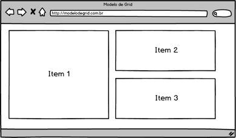
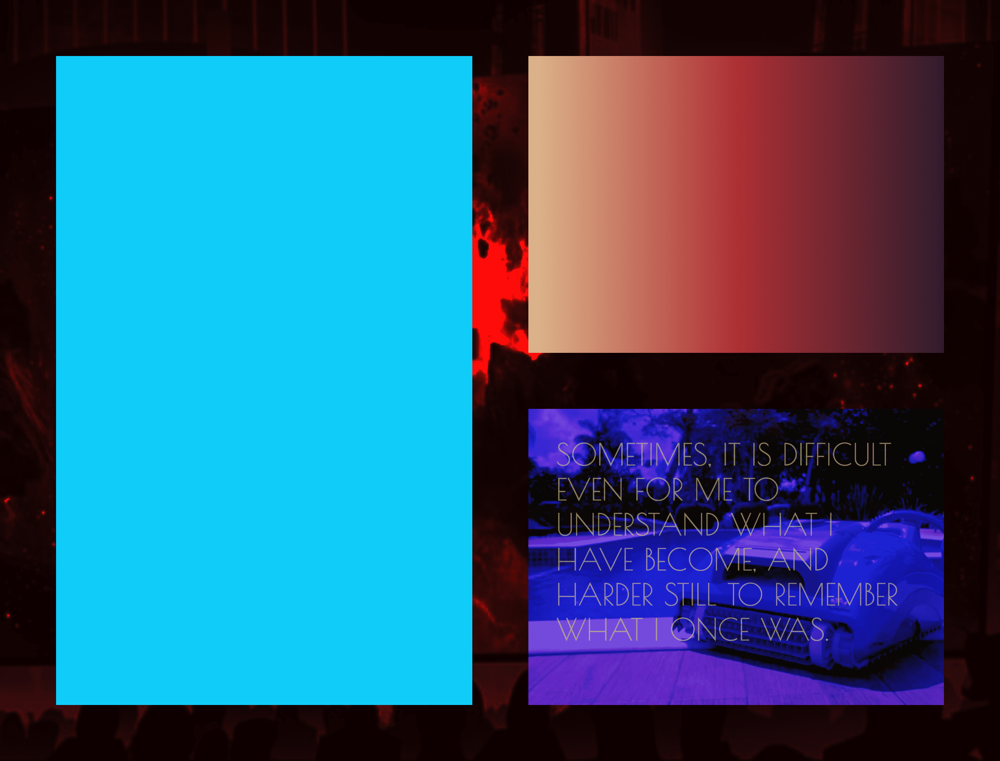

# Code7
``frontend challenge``

[Menu](https://github.com/carlitoshxcx/code7-frontend-challenge/tree/master/)

---

2. Utilizando as propriedades de grid do CSS3, cumpra os requisitos e implemente uma interface web a partir do seguinte modelo:

Requisitos
Item 1: Background na cor azul.
Item 2: Background em gradiente da esquerda para direita (duas cores distintas).
Item 3: Background com uma imagem e texto sobre a imagem.

---

### HTML desenvolvido:

##### Arquivo: 
[index.html](https://github.com/carlitoshxcx/code7-frontend-challenge/tree/master/css-grid/index.html)

#### Preview

