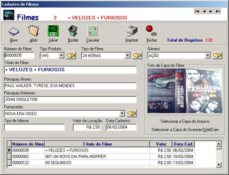
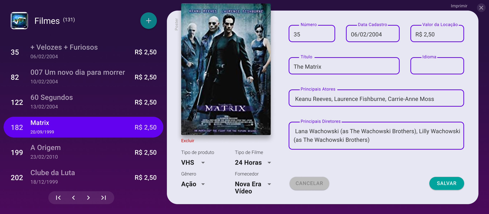

# Code7 ``frontend challenge``

1. A locadora Blockbuster deseja apostar em um novo sistema web de locações online para concorrer com os famosos serviços de streaming. Para garantir seu lugar no mercado, a empresa aposta no seu conhecimento de UI e UX para propor uma bela interface de Cadastro de Filmes dessa nova plataforma. Abaixo segue o modelo atual de interface que a Blockbuster usa atualmente:

Seu trabalho é realizar um protótipo de baixa fidelidade (wireframe) dessa nova proposta de interface para cadastro de filmes. É importante lembrar que todas as informações DO FILME e ações de PERSISTÊNCIA devem ser mantidas.

---

### Wireframe desenvolvido:

