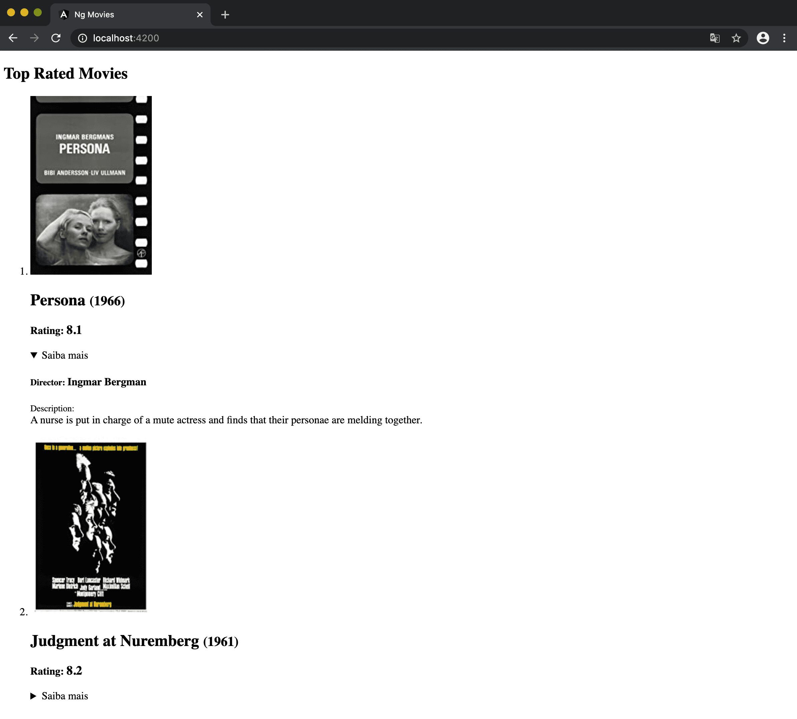

# Code7
``frontend challenge`` [ - Menu](https://github.com/carlitoshxcx/code7-frontend-challenge/tree/master/)


---

#### I didn't receive the file `FILMES.json`, so then I worked with IMDB:

1. Add these [bookmarklet/copy-top-rated-movies-on-imdb.js](https://github.com/carlitoshxcx/code7-frontend-challenge/tree/master/ng-movies/bookmarklet/copy-top-rated-movies-on-imdb.js) to bookmarks with this name: `Get Movies IDs`.

	```
	javascript: (function () { 
		moviesId = []; 
		document.querySelectorAll('#main > div > span > div > div > div.lister > table > tbody')[0].children.forEach(td => { 
			moviesId.push(td.children[1].children[0].href.split('/')[4]);
		});
		alert("Go to window console and type: copy(moviesId)"); 
	})();
	```

2. Access [IMDB Top Movies](https://www.imdb.com/chart/top/) and click on `Get Movies IDs` bookmark to get movies list.

3. Access browser console and type: `copy(moviesId)`.

#### Now you have the `IMDB Top 250 movies id list`, let's make this available to our Angular app.

1. Open file [src/data/movies.js](https://github.com/carlitoshxcx/code7-frontend-challenge/tree/master/ng-movies/src/data/movies.js)

2. Paste `movies id list` into `movies` value .

	```
	module.exports = {
	  movies: HERE_GOES_MOVIES_ID_LIST
	}
	```
	
3. Run the project! :fire:

---

### Preview

Data displayed for every movie:

- name
- year
- director
- rating (**Instead of Gender :sweat_smile:**)
- description
- poster




---


### Ng Movies


This project was generated with [Angular CLI](https://github.com/angular/angular-cli) version 9.1.7.

To install this app, please run `npm i` inside this folder `code7-frontend-challenge/ng-movies/`.

#### Development server

Run `ng serve` for a dev server. Navigate to `http://localhost:4200/`.


#### Build

Run `ng build` to build the project. The build artifacts will be stored in the `dist/` directory. Use the `--prod` flag for a production build.
